# 📋 Plano de Documentação do Tototion

## Visão Geral do Projeto

O **Tototion** é um editor de notas moderno e elegante construído com Electron, React e TypeScript. Este documento detalha o plano completo para criar uma documentação focada no usuário final.

### Características Principais Identificadas

- **Editor Rico**: Utiliza TipTap com suporte a formatação avançada (negrito, itálico, títulos, listas, citações, código, destaque)
- **Interface Moderna**: Design escuro e minimalista com Tailwind CSS
- **Salvamento Local**: Documentos armazenados localmente via electron-store
- **Busca Integrada**: Sistema de busca rápida de documentos
- **Multiplataforma**: Funciona em Windows, macOS e Linux
- **Atalhos de Teclado**: Suporte completo a atalhos para produtividade

## Estrutura da Documentação

```mermaid
graph TD
    A[📚 Documentação do Tototion] --> B[🚀 Guia de Início Rápido]
    A --> C[💡 Funcionalidades Principais]
    A --> D[📝 Guia do Editor]
    A --> E[🔍 Busca e Organização]
    A --> F[⚙️ Configurações]
    A --> G[❓ FAQ e Solução de Problemas]
    A --> H[📱 Atalhos de Teclado]
    
    B --> B1[Instalação]
    B --> B2[Primeiro Uso]
    B --> B3[Criando seu Primeiro Documento]
    
    C --> C1[Interface do Usuário]
    C --> C2[Sidebar de Navegação]
    C --> C3[Área de Edição]
    C --> C4[Barra de Ferramentas]
    
    D --> D1[Formatação de Texto]
    D --> D2[Títulos e Estrutura]
    D --> D3[Listas e Citações]
    D --> D4[Comandos Rápidos]
    
    E --> E1[Busca de Documentos]
    E --> E2[Criação de Documentos]
    E --> E3[Exclusão de Documentos]
    
    F --> F1[Preferências do Editor]
    F --> F2[Temas e Aparência]
    F --> F3[Backup e Dados]
    
    G --> G1[Problemas Comuns]
    G --> G2[Performance]
    G --> G3[Recuperação de Dados]
```

## Arquivos de Documentação Planejados

### 1. README.md (Atualizado)
**Objetivo**: Visão geral e início rápido
**Conteúdo**:
- Introdução ao Tototion
- Características principais
- Instalação rápida
- Links para documentação detalhada

### 2. docs/user-guide.md
**Objetivo**: Guia completo do usuário
**Conteúdo**:
- Tour completo da interface
- Funcionalidades principais
- Fluxo de trabalho típico
- Dicas de produtividade

### 3. docs/editor-guide.md
**Objetivo**: Guia detalhado do editor
**Conteúdo**:
- Todas as opções de formatação
- Comandos rápidos (/)
- Atalhos de teclado
- Exemplos práticos de uso

### 4. docs/troubleshooting.md
**Objetivo**: FAQ e solução de problemas
**Conteúdo**:
- Problemas comuns e soluções
- Dicas de performance
- Backup e recuperação de dados
- Suporte técnico

### 5. docs/keyboard-shortcuts.md
**Objetivo**: Referência completa de atalhos
**Conteúdo**:
- Atalhos de formatação
- Atalhos de navegação
- Comandos do editor
- Tabela de referência rápida

## Conteúdo Detalhado por Seção

### 🚀 Guia de Início Rápido
- **Instalação**: 
  - Download e instalação para Windows, macOS e Linux
  - Requisitos do sistema
  - Primeira execução
- **Primeiro Uso**: 
  - Tour pela interface
  - Conceitos básicos
  - Configuração inicial
- **Criando seu Primeiro Documento**: 
  - Tutorial passo a passo
  - Salvamento automático
  - Navegação básica

### 💡 Funcionalidades Principais
- **Visão Geral da Interface**: 
  - Layout geral
  - Áreas principais
  - Navegação entre seções
- **Sidebar de Navegação**: 
  - Lista de documentos
  - Busca rápida
  - Criação de novos documentos
- **Área de Edição**: 
  - Editor TipTap
  - Formatação em tempo real
  - Visualização do conteúdo
- **Barra de Ferramentas**: 
  - Ferramentas de formatação
  - Organização por grupos
  - Estados ativos/inativos

### 📝 Guia Completo do Editor
- **Formatação de Texto**: 
  - Negrito (Ctrl+B)
  - Itálico (Ctrl+I)
  - Sublinhado (Ctrl+U)
  - Riscado
  - Código inline
  - Destaque/Highlight
- **Títulos e Estrutura**: 
  - H1, H2, H3
  - Hierarquia de conteúdo
  - Navegação por títulos
- **Listas**: 
  - Listas com marcadores
  - Listas numeradas
  - Aninhamento de listas
- **Citações**: 
  - Blockquotes
  - Formatação especial
  - Uso adequado
- **Comandos Rápidos**: 
  - Sistema de "/" para comandos
  - Lista completa de comandos
  - Atalhos de produtividade

### 🔍 Busca e Organização
- **Sistema de Busca**: 
  - Busca por título
  - Busca por conteúdo
  - Filtros disponíveis
- **Criação de Documentos**: 
  - Processo de criação
  - Nomeação de documentos
  - Templates básicos
- **Gerenciamento**: 
  - Edição de documentos
  - Duplicação
  - Exclusão segura

### ⚙️ Configurações e Personalização
- **Preferências do Editor**: 
  - Configurações disponíveis
  - Personalização da interface
  - Comportamento do editor
- **Aparência**: 
  - Tema escuro (padrão)
  - Customizações visuais
  - Acessibilidade
- **Dados Locais**: 
  - Localização dos arquivos
  - Estrutura de armazenamento
  - Backup manual

### 📱 Atalhos de Teclado
- **Formatação**: 
  - Ctrl+B (Negrito)
  - Ctrl+I (Itálico)
  - Ctrl+U (Sublinhado)
  - Ctrl+Shift+X (Riscado)
  - Ctrl+E (Código)
- **Navegação**: 
  - Atalhos para navegar pela interface
  - Foco entre elementos
  - Navegação por documentos
- **Comandos Especiais**: 
  - "/" para comandos rápidos
  - Esc para cancelar ações
  - Enter para confirmar

### ❓ FAQ e Solução de Problemas
- **Problemas Comuns**: 
  - Aplicativo não inicia
  - Documentos não salvam
  - Performance lenta
  - Problemas de formatação
- **Performance**: 
  - Otimização do aplicativo
  - Limpeza de dados
  - Requisitos de sistema
- **Backup e Recuperação**: 
  - Como fazer backup
  - Restaurar documentos
  - Migração de dados
  - Localização dos arquivos

## Diretrizes de Escrita

### Linguagem e Tom
- **Idioma**: Português brasileiro
- **Tom**: Amigável e acessível para usuários finais
- **Estilo**: Instruções claras e passo a passo
- **Exemplos**: Práticos e relevantes para o uso cotidiano

### Formatação
- **Títulos**: Hierarquia clara com emojis para identificação visual
- **Listas**: Uso extensivo de listas para facilitar a leitura
- **Código**: Destacar atalhos de teclado e comandos
- **Imagens**: Screenshots e GIFs demonstrativos (quando possível)

### Estrutura dos Documentos
- **Introdução**: Breve explicação do que será abordado
- **Índice**: Para documentos longos
- **Seções**: Bem organizadas com subtítulos
- **Exemplos**: Casos práticos de uso
- **Referências**: Links para outras seções relevantes

## Recursos Visuais Planejados

### Screenshots
- Interface principal do aplicativo
- Sidebar com lista de documentos
- Editor com diferentes formatações
- Barra de ferramentas em ação
- Resultados de busca

### GIFs Demonstrativos
- Criação de um novo documento
- Uso de formatação básica
- Sistema de busca em ação
- Comandos rápidos com "/"

### Diagramas
- Estrutura da interface
- Fluxo de trabalho do usuário
- Organização dos dados locais

## Cronograma de Implementação

1. **Fase 1**: Atualização do README.md
2. **Fase 2**: Criação do user-guide.md
3. **Fase 3**: Desenvolvimento do editor-guide.md
4. **Fase 4**: Elaboração do troubleshooting.md
5. **Fase 5**: Compilação do keyboard-shortcuts.md
6. **Fase 6**: Revisão e ajustes finais

## Critérios de Sucesso

- Documentação completa e acessível para usuários finais
- Linguagem clara e instruções fáceis de seguir
- Cobertura de todas as funcionalidades principais
- Solução para problemas comuns
- Referência rápida para atalhos e comandos
- Estrutura organizada e navegável

---

**Nota**: Este plano serve como guia para a criação da documentação completa do Tototion, focando na experiência do usuário final e na facilidade de uso do aplicativo.